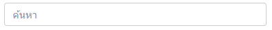

# บทนำ

## คู่มือนี้สำหรับ

พนักงานทั่วไปที่ใช้ระบบ starkempowerment.com

## โครงสร้างของคู่มือ

คู่มือระบบ STARK Human Resource Management System ประกอบไปด้วย

**บทที่ 1: บทนำ** – อธิบายการใช้งานคู่มือ STARK Human Resource Management System ซึ่งประกอบไปด้วยโครงสร้างของคู่มือ สัญลักษณ์ที่ใช้ในคู่มือ และ ตัวกรองที่ใช้ในระบบ เพื่อเสริมความเข้าใจในการอ่านคู่มือให้ง่ายขึ้น

**บทที่ 2: ข้อมูลเบื้องต้นของระบบ** – กล่าวถึงคุณสมบัติโดยรวมของระบบ STARK Human Resource Management System และ Browser ที่รองรับในการใช้งาน&#x20;

**บทที่ 3: วิธีการเข้าใช้งานระบบ** – อธิบายถึงการใช้งานเมนูต่างๆในระบบ STARK Human Resource Management System ซึ่งประกอบไปด้วยเมนูดังนี้&#x20;

**      บทที่ 3.1: Login** - อธิบายการเข้าใช้งานในระบบ&#x20;

&#x20;     **บทที่ 3.2: หน้าแรก** - แสดงภาพรวมของหน้าแรกในระบบ&#x20;

&#x20;     **บทที่ 3.3: เมนูข้อมูลส่วนตัว **– อธิบายภาพรวมและการใช้งานหน้าข้อมูลส่วนตัว&#x20;

**      บทที่ 3.3: เมนู Dashboard** – อธิบายภาพรวมและการใช้งานหน้า Dashboard ซึ่งประกอบไปด้วยหน้า Dashboard ของการเข้างาน (TA) และการทำงานล่วงเวลา (OT)&#x20;

**      บทที่ 3.4: เมนูข่าว** – อธิบายภาพรวมและการใช้งานหน้าเมนูข่าวที่ทางบริษัทเผยแพร่

**      บทที่ 3.5: เมนูประกาศ **– อธิบายภาพรวมและการใช้งานหน้าเมนูประกาศที่ทางบริษัทเผยแพร่

**      บทที่ 3.6: เมนูการแจ้งเตือน (Notification)** – อธิบายภาพรวมและการแสดงผลในหน้าการแจ้งเตือน&#x20;

**      บทที่ 3.7: เมนูศูนย์การอนุมัติ (Approval Center)** – (สำหรับพนักงานที่มีพนักงานใต้บังคับบัญชา) อธิบายภาพรวมและการใช้งานในหน้าศูนย์การอนุมัติ&#x20;

**      บทที่ 3.8: เมนูส่วนหลัก (Core) **– (สำหรับพนักงานที่มีพนักงานใต้บังคับบัญชา) อธิบายภาพรวมและการใช้งานของเมนูส่วนหลัก ซึ่งประกอบไปด้วย เมนูพนักงานใต้บังคับบัญชาทั้งหมด (Subordinate List)

**      บทที่ 3.9: เมนูเวลาทำงาน (TA)** – อธิบายภาพรวมและการใช้งานของเมนูเวลาทำงาน ซึ่งประกอบไปด้วยเมนูเวลาการทำงานประจำวัน (Timesheet) สิทธิ์การลา (Leave) และ จัดการคำขอล่วงเวลา (OT Request)

## สัญลักษณ์ที่ใช้ในคู่มือ

| **สัญลักษณ์**              | **ความหมาย**                                                  |
| -------------------------- | ------------------------------------------------------------- |
| ข้อความ**ตัวหนา**          | คำสั่ง, คำเฉพาะ, เมนู, ปุ่ม, ตัวเลือกที่ถูกเลือกระหว่างใช้งาน |
| ข้อความ_ตัวเอียง_          | ค่าต่างๆที่ใช้กรอกข้อมูล                                      |
| **เมนู > หน้าเว็บไซต์ใดๆ** | ตำแหน่งของเมนู หรือหน้าเว็บไซต์ในระบบใดๆ                      |


**คำแนะนำ:** คำแนะนำคือข้อมูลที่ช่วยให้งานระบบได้ดียิ่งขึ้น



**หมายเหตุ: **ข้อมูลสำคัญที่ผู้ใช้งานควรทราบ



**คำเตือน: **ข้อมูลที่ผู้ใช้งานต้องพิจารณาและระมัดระวัง


## รูปแบบการกรองที่ใช้ในระบบ

เมื่อผู้ใช้งานต้องการค้นหาข้อมูลในแต่ละหน้าเมนู ผู้ใช้งานสามารถกรอง เรียงลำดับ และจำกัดการแสดงผลของข้อมูล ตามที่แต่ละหน้าเมนูจัดเตรียมไว้ โดยมีตัวกรองดังต่อไปนี้

### 1. การค้นหา (Filter)

* **คำค้นหา**&#x20;
  * ผู้ใช้งานสามารถค้นหาข้อมูลโดยการพิมพ์ข้อความที่ตรงกับข้อมูลนั้นๆลงไปในช่องคำค้นหา ข้อมูลจะแสดงผลหลังจากที่ผู้ใช้งานพิมพ์ข้อมูล

* **วันที่/ช่วงวันที่**
  * ผู้ใช้งานสามารถค้นหาข้อมูลในช่วงเวลาใดเวลาหนึ่งด้วยตัวกรองวันที่ โดยผู้ใช้งานสามารถ พิมพ์วันที่ที่ต้องการลงในช่องด้วยรูปแบบ วัน/เดือน/ปี หรือคลิกเลือกวันที่ตรงปุ่ม**ปฏิทิน**

.png>)

.png>)

*   **ตัวเลือกแบบค้นหาได้**

    * ผู้ใช้งานสามารถกรองข้อมูลที่จะค้นหาด้วยการเลือกตัวเลือกใดตัวเลือกหนึ่งที่เกี่ยวข้องกับข้อมูลนั้นๆ เช่น ต้องการดูข้อมูลตามสถานที่ ในกรณีที่ตัวเลือกมีจำนวนมาก ผู้ใช้งานสามารถพิมพ์ข้อความที่ตรงกับตัวเลือกนั้นๆเพื่อหาตัวเลือกที่ต้องการได้

.png>)

* **หน่วยงาน**
  *

      ผู้ใช้งานสามารถค้นหาข้อมูลและกรองตามหน่วยงานได้ โดยคลิกปุ่ม **เลือกหน่วยงาน** ดังรูป 1.6 เมื่อคลิกแล้ว จะแสดงผลหน่วยงานแบบ Tree ของทุกบริษัท

.png>)

.png>)

*   **ตำแหน่งงาน**

    * ผู้ใช้งานสามารถค้นหาข้อมูลและกรองตามตำแหน่งได้ โดยคลิกปุ่ม เลือกตำแหน่งงานดังรูป เมื่อคลิกแล้ว จะแสดงผลตำแหน่งงานแบบ Tree ของทุกบริษัท ผู้ใช้งานสามารถกรองข้อมูลตำแหน่งงานด้วย คำค้นหา ชื่อผู้ดำรงตำแหน่ง และ หน่วยงาน เพื่อแสดงผลเท่าที่จำเป็น

.png>)

.png>)


ในบางกรณีที่ผู้ใช้งานค้นหาข้อมูลไม่เจอ สาเหตุหนึ่งอาจเกิดจากการที่มีข้อมูลในตัวกรองบางตัวค้างอยู่ ผู้ใช้งานสามารถล้างตัวกรองได้ด้วยวิธีดังต่อไปนี้

1. ลบข้อมูลในตัวกรองทิ้ง
2. คลิกปุ่ม **กากบาท **หรือ **ล้าง** (แล้วแต่ประเภทของตัวกรอง)
3. ล้างตัวกรองทั้งหมดโดยคลิกปุ่ม **ล้างตัวกรอง**




ในบางเมนู ผู้ใช้งานสามารถบันทึกตัวกรองที่จำเป็นต้องใช้บ่อยได้ โดยการใส่ค่าในตัวกรองที่ต้องการจะบันทึกแล้วกดปุ่ม **บันทึก **ผู้ใช้งานจำเป็นต้องตั้งชื่อตัวกรองเพื่อสามารถเลือกใช้ได้ในอนาคต


### 2. การเรียงลำดับ (Sorting)

ในการแสดงผลข้อมูลบางเมนู ผู้ใช้งานสามารถเรียงลำดับของข้อมูลด้วยการคลิกตัวเลือกตามที่หน้าเมนูนั้นมี เช่น ต้องการแสดงรายชื่อพนักงานทั้งหมดพร้อมกะการทำงาน ในหน้า **เวลาทำงาน** **(TA) > เวลาการทำงานประจำวัน (Timesheet) > บันทึกเวลาการทำงานประจำวัน** โดยเรียงลำดับจากวันที่ น้อยไปมาก เป็นต้น

.png>)

### 3. การจำกัดการแสดงผลของข้อมูล (Pagination)

ข้อมูลการแสดงผลแบบตารางมักมีจำนวนข้อมูลหลายแถว ผู้ใช้งานสามารถจำกัดจำนวนการแสดงผลของข้อมูลได้ที่แถบที่มีลักษณะดังรูป โดยส่วนประกอบมีดังนี้

.png>)

1. **ผลลัพธ์ของจำนวนข้อมูลที่แสดง** - หมายความว่า ตอนนี้ข้อมูลลำดับที่ 1-5 จากทั้งหมด 642 แถวกำลังแสดงผล
2. **หน้าของข้อมูลที่กำลังแสดงอยู่** - หมายความว่า กำลังแสดงข้อมูลหน้าที่ 1 ผู้ใช้งานสามารถแสดงผลข้อมูลหน้าใดๆด้วยการคลิกตัวเลขหน้านั้นๆ แสดงข้อมูลหน้าถัดไปหรือก่อนหน้า 1 หน้าด้วยการคลิกที่ปุ่ม หรือ ตามลำดับ และแสดงข้อมูลหน้าแรกหรือหน้าสุดท้ายด้วยการคลิกปุ่ม หรือ ตามลำดับ
3. **จำนวนข้อมูลที่ต้องการให้แสดง** -  หมายความว่า ต้องการให้ข้อมูลแสดงเพียง 5 แถว

.png>)
